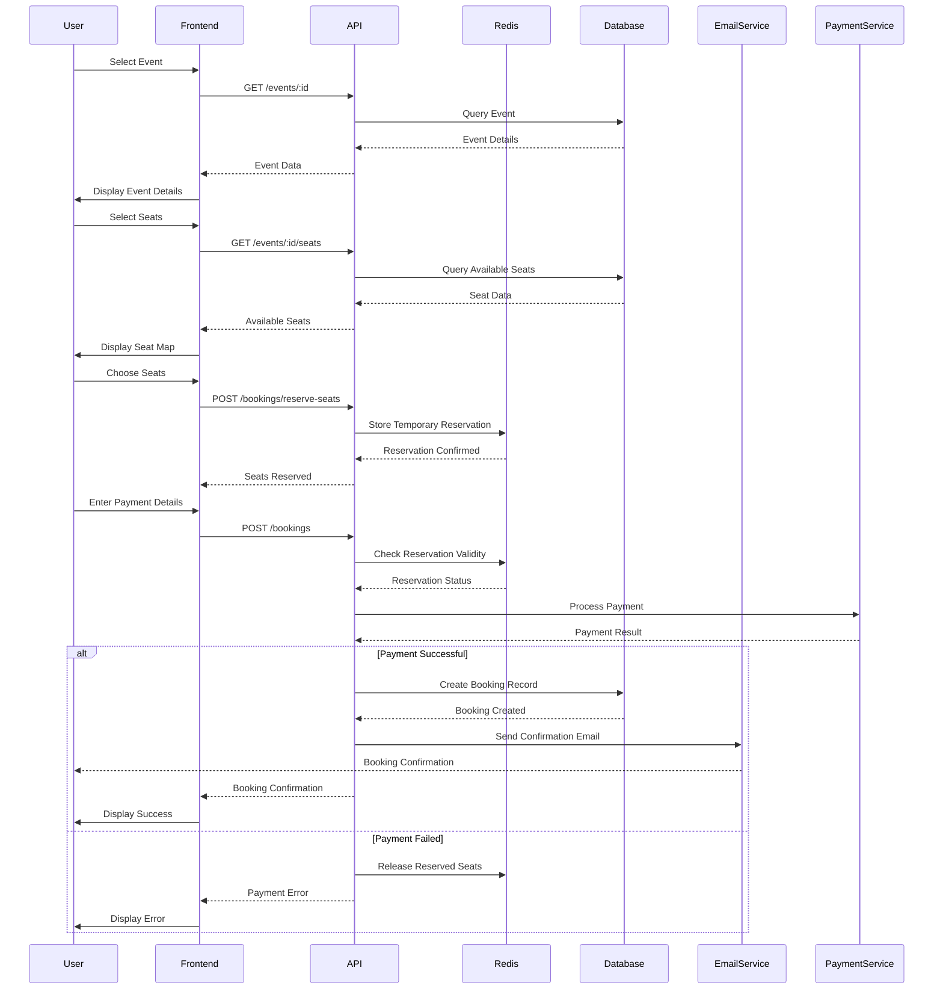
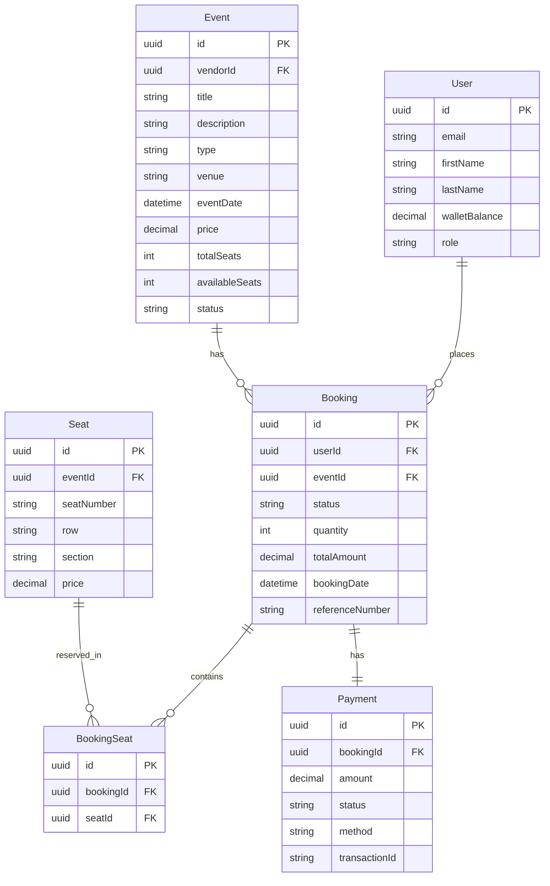

# Booking Implementation

This document outlines the implementation of the event booking functionality in the Universal Ticket Booking system.

## Architecture Overview

The booking system follows a layered architecture:

1. **Frontend**: React components for seat selection, payment, and booking confirmation
2. **API Layer**: Express.js routes and controllers that handle booking requests
3. **Service Layer**: Business logic for booking processing, payment handling, and notifications
4. **Data Layer**: Database models and Redis for temporary seat reservations

## Booking Flow

## Key Components

### Frontend Components

1. **SeatSelection**: Interactive seat map for selecting seats
   - Displays seat availability status (available, selected, booked, reserved)
   - Handles seat selection with visual feedback
   - Groups seats by section and row

2. **PaymentForm**: Form for collecting payment details
   - Supports credit card and wallet payment methods
   - Validates credit card details
   - Formats card numbers and expiry dates
   - Detects card type (Visa, MasterCard, etc.)

3. **Booking Page**: Handles the booking process
   - Shows booking summary
   - Integrates payment form
   - Displays booking confirmation
   - Handles error states

### Backend Components

1. **Booking Controller**: Handles API requests
   - Seat availability checking
   - Temporary seat reservation
   - Booking creation
   - Booking retrieval
   - Booking cancellation

2. **Redis Integration**: Manages temporary seat reservations
   - Stores seat IDs with expiration time
   - Prevents double-booking
   - Automatically releases seats after timeout

3. **Payment Processing**: Handles payment methods
   - Wallet balance checking and deduction
   - Credit card validation and processing
   - Refund processing for cancellations

4. **Email Notifications**: Sends booking-related emails
   - Booking confirmation with ticket details
   - Booking cancellation with refund information

5. **PDF Ticket Generation**: Creates downloadable tickets
   - Includes event details and seat information
   - Generates QR code for verification
   - Formatted for printing

## Database Schema

## API Endpoints

### Seat Management

- **GET /api/events/:id/seats**: Fetches available seats for an event
- **POST /api/bookings/reserve-seats**: Temporarily reserves seats

### Booking Management

- **POST /api/bookings**: Creates a new booking
- **GET /api/bookings**: Fetches user's bookings
- **GET /api/bookings/:id**: Fetches a specific booking
- **DELETE /api/bookings/:id**: Cancels a booking
- **GET /api/bookings/:id/ticket**: Downloads a PDF ticket

## Error Handling

The booking system implements comprehensive error handling:

1. **Frontend**:
   - Loading states for API operations
   - Error messages for failed operations
   - Retry mechanisms for transient errors
   - Validation for user inputs

2. **Backend**:
   - Input validation using middleware
   - Appropriate HTTP status codes for errors
   - Descriptive error messages
   - Transaction rollback for failed operations
   - Logging for debugging

## Future Improvements

1. **Seat Locking**: Implement more sophisticated seat locking mechanism
2. **Payment Gateway Integration**: Add support for multiple payment providers
3. **Group Bookings**: Allow booking adjacent seats as a group
4. **Dynamic Pricing**: Implement price adjustments based on demand
5. **Mobile Tickets**: Add support for mobile wallet tickets (Apple Wallet, Google Pay)
6. **Booking Modifications**: Allow users to modify existing bookings 